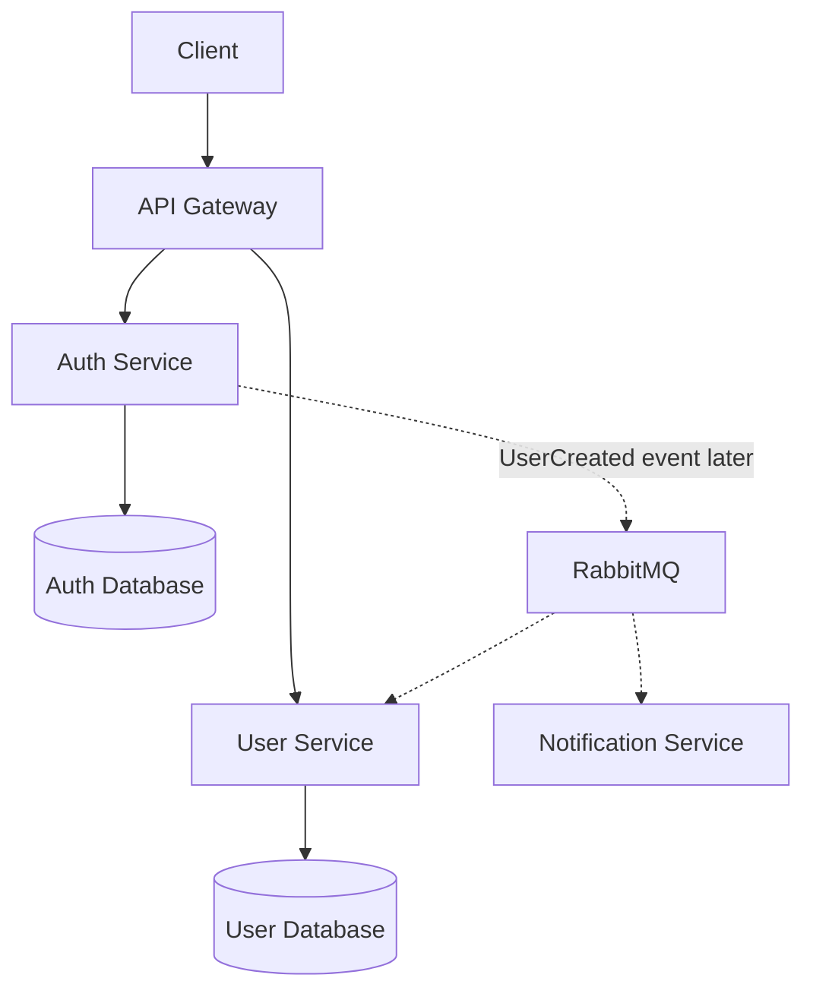
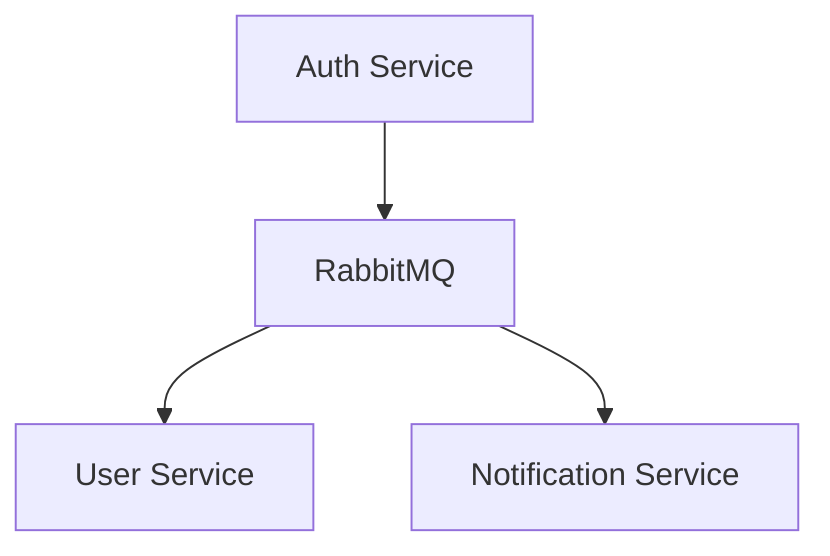

<<<<<<< HEAD
# Gateway

Django microservice containing the `gateway` application.

## Run locally

```bash
python -m venv .venv
source .venv/bin/activate
pip install -r requirements.txt
python src/manage.py migrate
python src/manage.py runserver
```

## Run with Docker

```bash
docker compose up --build
```
=======
## Microservices Authentication System

A learning project built with **Django 5.2.7** using a microservices architecture. The project demonstrates how to build independent services with separate databases, an API Gateway, JWT authentication, and eventually asynchronous communication using RabbitMQ.

> **Current Goal:** Build a complete authentication flow through the API Gateway using synchronous communication between Auth Service and User Service. RabbitMQ/Kafka will be introduced later.

---

# Architecture



## Service Responsibilities

### Auth Service
Responsible for:

- User authentication
- Password hashing
- JWT generation
- Refresh tokens
- Account activation

Database contains:

- id
- email
- password_hash
- is_active
- created_at

---

### User Service

Responsible for:

- User profile
- First name
- Last name
- Avatar
- Bio
- Preferences

Database contains:

- id
- auth_user_id
- first_name
- last_name
- bio
- avatar
- created_at

> `auth_user_id` is an external identifier and **not** a database foreign key.

---

### Notification Service

Responsible for:

- Email notifications
- Welcome messages
- Notification history
- Delivery status

---

### API Gateway

Responsible for:

- Routing requests
- Rate limiting
- Request IDs
- Timeouts
- Forwarding client information

The gateway **does not** contain business logic.

---

# Registration Flow

```text
POST /api/auth/register
        ↓
API Gateway
        ↓
Auth Service creates account
        ↓
Auth Service requests profile creation
from User Service
        ↓
Auth Service returns JWT and user info
```

Example request

```json
{
  "email": "anower@example.com",
  "password": "StrongPassword123",
  "first_name": "Anower",
  "last_name": "Hossain"
}
```

---

# Login Flow

```text
POST /api/auth/login
        ↓
Auth Service
        ↓
JWT Access Token
```

---

# Profile Flow

```text
GET /api/users/me
Authorization: Bearer <access-token>
        ↓
API Gateway
        ↓
User Service
        ↓
Validate JWT
        ↓
Read auth_user_id
        ↓
Return profile
```

---

# JWT Claims

Example payload

```json
{
  "sub": "auth-user-uuid",
  "email": "anower@example.com",
  "roles": ["user"],
  "iss": "auth-service",
  "aud": "microservices-lab",
  "exp": 1784350000
}
```

Recommended approach:

- Auth Service signs JWT using an RSA private key.
- API Gateway validates using the public key.
- User Service validates using the public key.
- Private key exists only inside Auth Service.

---

# Internal Service Communication

Internal endpoint

```http
POST /internal/profiles
```

Headers

```http
X-Internal-Service-Key: <service-secret>
```

Example body

```json
{
  "auth_user_id": "40e63125-0188-4454-9ae4-72ae477d83db",
  "first_name": "Anower",
  "last_name": "Hossain"
}
```

Requirements

- Internal authentication
- Short timeout
- Idempotent requests
- Return existing profile if already created
- Never expose this endpoint publicly

---

# Project Roadmap

## Milestone 1 — Infrastructure

- Docker Compose
- API Gateway
- Auth Service
- User Service
- PostgreSQL for Auth
- PostgreSQL for User
- Shared Docker network
- Environment variables
- Health checks

---

## Milestone 2 — API Gateway

Routing

```text
/api/auth/*  → Auth Service
/api/users/* → User Service
```

Gateway responsibilities

- Routing
- Request IDs
- Rate limiting
- Timeouts
- Client forwarding

---

## Milestone 3 — Service Communication

Implement synchronous communication

```text
Auth Service
      │
      └────────HTTP────────► User Service
```

Create the user profile immediately after successful registration.

---

## Milestone 4 — Handle Failures

Example failure

```text
Auth Service ✓
User Service ✗
```

Result

- Account exists
- Profile missing

Handle using

- HTTP timeout
- Retry
- Error logging
- PROFILE_PENDING status
- Reconciliation job

Avoid distributed database transactions.

---

## Milestone 5 — Event-Driven Architecture

Replace synchronous profile creation with RabbitMQ.



Registration flow

```text
Auth Service
      ↓
Publish UserCreated
      ↓
RabbitMQ
      ↓
User Service
      ↓
Create Profile
      ↓
Notification Service
      ↓
Send Welcome Notification
```

Example event

```json
{
  "event_id": "unique-event-uuid",
  "event_type": "user.created",
  "event_version": 1,
  "occurred_at": "2026-07-18T02:00:00Z",
  "data": {
    "auth_user_id": "40e63125-0188-4454-9ae4-72ae477d83db",
    "email": "anower@example.com",
    "first_name": "Anower",
    "last_name": "Hossain"
  }
}
```

Future topics

- Transactional Outbox
- Event Versioning
- Retry Queues
- Dead Letter Queues
- At-least-once Delivery
- Idempotent Consumers
- Eventual Consistency

Kafka can be introduced later for event replay, durable event storage, and high-throughput processing.

---

# Microservices Trade-offs

| Benefit | Consequence |
|----------|-------------|
| Independent services | More repositories |
| Separate databases | Eventual consistency |
| Independent deployment | More infrastructure |
| Failure isolation | Network failures |
| Team ownership | API contracts |
| Async messaging | Duplicate messages |
| Independent releases | Backward compatibility |

---

# Concept

The immediate objective is to complete this flow:

```text
Client
   │
   ▼
API Gateway
   │
   ├────────► Auth Service ───────► JWT
   │
   └────────► User Service ───────► Profile
```

Once the synchronous version works correctly in Docker Compose, RabbitMQ will be introduced to replace direct service-to-service communication and move toward an event-driven architecture.
>>>>>>> f5e329fbe07ee09da642dd88ce7d3cec6a862ef3
